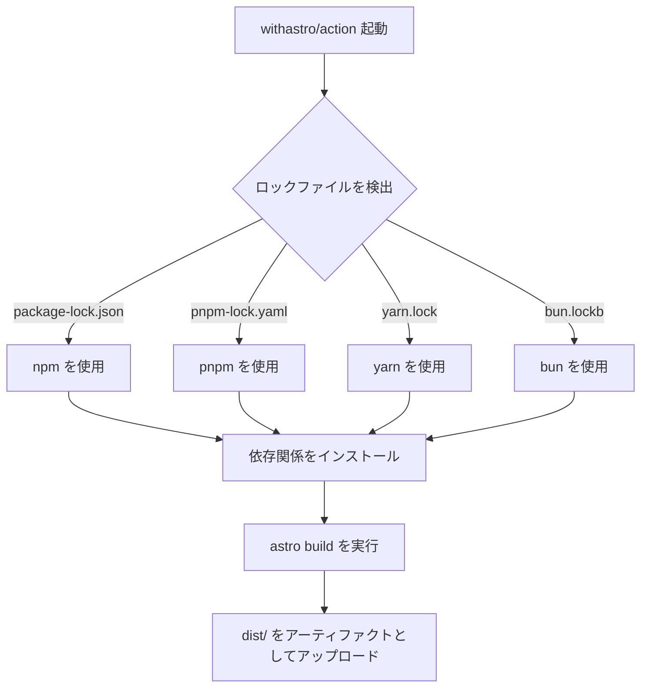

# AstroをGitHub Pagesにデプロイする

## はじめに

前回、AstroとSvelteでプロジェクトを作りました。今回はそのプロジェクトをGitHub Pagesで公開するまでの手順を記録します。

## なぜGitHub Pagesを選んだか

GitHub Pagesを選んだ理由は以下の通りです。

- 無料で使える
- 設定が簡単
- GitHubアカウントさえあれば始められ、他のサービスが不要
- 今回のブログにSSRは不要
- 学習目的のプロジェクトなのでリポジトリをPublicにしても問題なし

## デプロイ手順

Astroの公式ドキュメントにGitHub Pagesへのデプロイ手順が載っています。今回は基本的にこの手順に従いました。

[AstroサイトをGitHub Pagesにデプロイする](https://docs.astro.build/ja/guides/deploy/github/)

### 1. GitHub Actionsワークフローの設定

`.github/workflows/deploy.yml`を作成します。公式ドキュメントにサンプルが載っているので、コピペするだけで動きます。

`deploy.yml`の中を見てみると、`build`ジョブでAstro公式のGitHub Actions `withastro/action`[^1]が使われています。依存関係のインストールからビルド、ビルド成果物のアップロードまでまとめてやってくれています。

[^1]: https://github.com/withastro/action



### 2. `astro.config.mjs`の設定

`site`と`base`を追加します。

```js
import svelte from "@astrojs/svelte";
import { defineConfig } from "astro/config";

export default defineConfig({
  integrations: [svelte()],
  site: "https://<username>.github.io",
  base: "<repositoryname>",
});
```

この設定により、AstroがビルドするときのルートURLが`https://<username>.github.io/<repositoryname>`になります。

注意が必要なのは`base`を設定すると、コード内に書くリンクにも`/<repositoryname>`を付ける必要があることです。

```html
<a href="/<repositoryname>/about">About</a>
```

### 3. GitHubの設定

GitHubで対象リポジトリの「Settings」 > 「Pages」を開き、「Build and deployment」のSourceで「GitHub Actions」を選択します。

あとはプロジェクトをコミット&プッシュするだけです。

## 注意: 公開情報の管理

GitHub Pagesで公開できるのはPublicなリポジトリのみです。コミットする際に公開したくない情報が含まれていないか注意が必要です。

特に気をつけたいのがGitの`user.email`です。デフォルト設定のままコミットすると、メールアドレスがコミット履歴として公開されてしまいます。

GitHubでメールアドレスを非公開にする手順は以下の通りです。

1. GitHub右上のユーザーアイコン > Settings > Emails
2. 「Keep my email addresses private」をOnにする
3. Onにすると`@users.noreply.github.com`ドメインのメールアドレスが払い出される
4. 「Block command line pushes that expose my email」もOnにする
5. 払い出されたnoreplyアドレスをローカルのGitに設定する

```bash
git config --global user.email "<sample>@users.noreply.github.com"
```

[Githubドキュメント:コミットメールアドレスを設定する](https://docs.github.com/ja/account-and-profile/how-tos/email-preferences/setting-your-commit-email-address)

## おわりに

Astro公式の手順に従うことで、GitHub Actionsの設定から`astro.config.mjs`の変更、GitHubの設定まで、つまずくことなくデプロイできました。

次回は技術選定の背景をADRとしてまとめた話を書く予定です。
