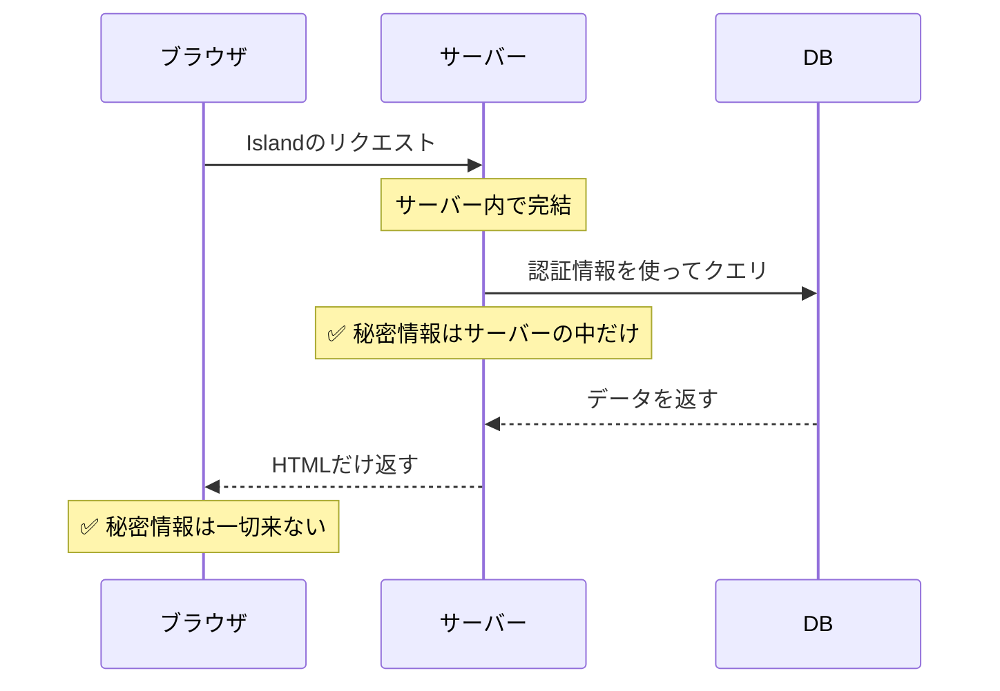
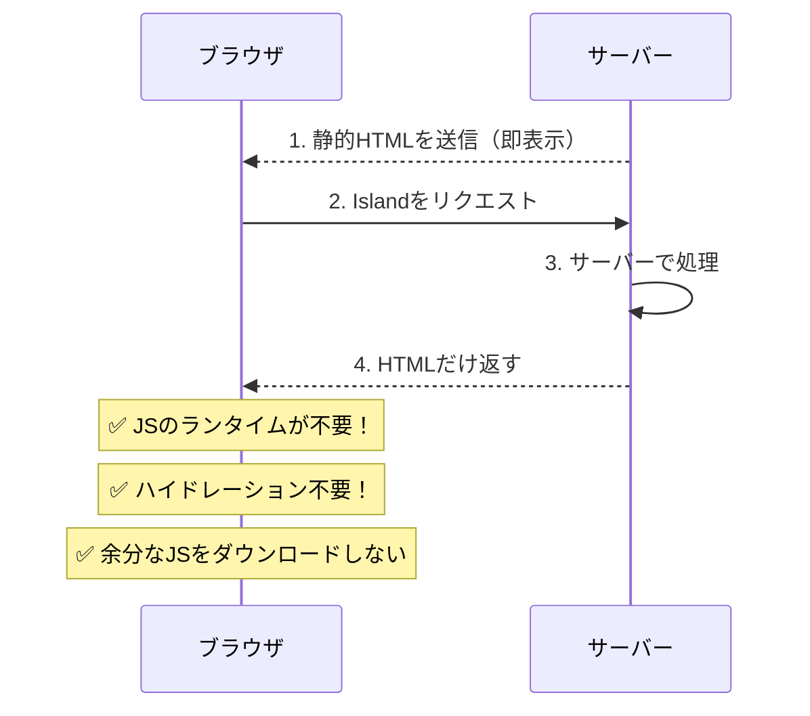

# 第4.5回: .astroファイルの基本とサーバーアイランド

## はじめに

コンテンツコレクションの記事を書いていたら、その前提となるAstroの基本的な仕組みをほとんど説明していなかったことに気づきました。「4.5回」として補足します。

## ファイルベースルーティング

Astroはファイルベースルーティングを採用しています。`src/pages/`に置いたファイルがそのままページになります。対応しているファイル形式は以下のとおりです。

| 形式 | 用途 |
| --- | --- |
| `.astro` | Astroコンポーネント |
| `.md` / `.mdx` | Markdownコンテンツ |
| `.html` | 静的HTML |
| `.js` / `.ts` | APIエンドポイント |

`src/pages/`にMarkdownファイルを置くと、ビルド時に自動でHTMLに変換されます。試しにやってみたらファイルを置くだけでページになっていて、シンプルだなと思いました。

## .astroファイルの書き方

`.astro`ファイルは、フロントマター（`---`で囲まれた部分）にJavaScriptを書けます。書き方はJSXに近い感じです。

```html
---
const content = "Hoge";
const show = true;
const array = ["A", "B", "C"];
---

<div>
  { content }
  {show && <p>You can see</p>}
  <ul>
    {array.map((str) => <li>{str}</li>)}
  </ul>
</div>
```

フロントマター内のコードは基本的にビルド時にサーバーサイドで実行されます。なお、`.astro`ファイル自体はクライアントアイランドコンポーネントにはできません。アイランドコンポーネントにできるのはReact・Svelte・Vueなどのフレームワークコンポーネントだけです。アイランドの再レンダリングルールは、選択したフレームワーク側のルールに従います。

## サーバーアイランドの使い所

AstroにはSSRを使った**サーバーアイランド**という仕組みがあります。コンポーネント単位でサーバーサイドレンダリングを行えます。

向いているユースケースは次のようなものです。

- ユーザー固有の情報や認証が必要なデータ
- リアルタイムに近いデータ

サーバーアイランドを使うと、DBの認証情報などの秘密情報がブラウザに渡らずサーバー内で完結します。



また、静的HTMLを先に返してからサーバーアイランドだけ後から差し込む構成にもできます。クライアント側でのハイドレーションが不要なのでJSのダウンロードを最小化できます。



コード側もすっきりします。

```astro
---
// awaitが使える
const orders = await db.getOrders(Astro.locals.userId);
---

<ul>
  {orders.map(o => <li>{o.name}</li>)}
</ul>
```

### このブログを作るのには使わない

サーバーアイランドは便利そうですが、このブログでは使いません。理由は2つあります。

- **ユースケースがない**: 認証もなく、ユーザー固有のデータも扱わない
- **アーキテクチャが合わない**: GitHub Pagesへの静的配信を前提としているので、サーバーサイドで動的に処理する場所がそもそもない

「表示するだけの動的データ」がないので、全部ビルド時に解決できます。

## まとめ

- `src/pages/`に置いたファイルがそのままルーティングされる
- `.astro`のフロントマターにはJSが書けて、ビルド時に実行される
- サーバーアイランドは認証や動的データに向いているが、静的ブログでは出番がない

次回（第5回）はコンテンツコレクションを使って記事ページを作ります。
